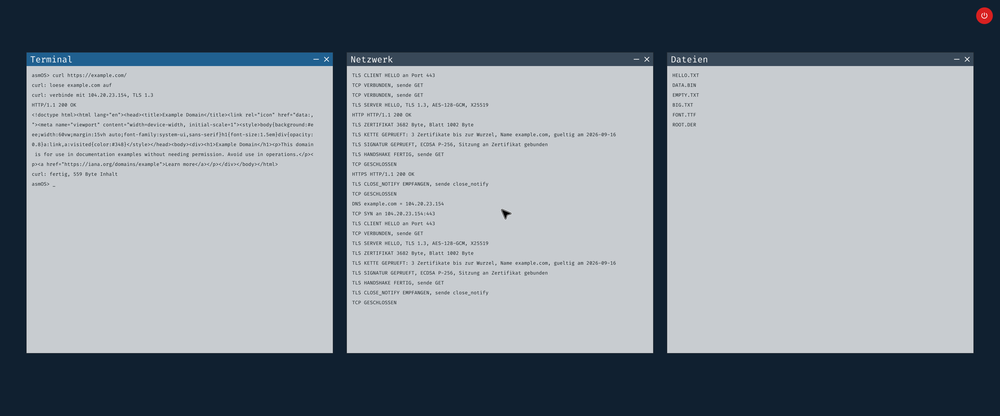

<div align="center">

# asmOS

**As**sembler **O**perating **S**ystem

**Ein Betriebssystem, von Hand in Assembler geschrieben, gebaut als Monolith.**

Kein Linux darunter. Keine Bibliotheken. Kein C.<br>
Nur Maschinenbefehle für ARM-Prozessoren, ein Linker-Skript und ein Makefile.


<br>



<sub><i>Das laufende System: links das Terminal nach <code>curl https://example.com/</code>, in der Mitte das Netzwerkfenster mit Handshake und Kettenprüfung, rechts der Inhalt des Datenträgers.</i></sub>

<br><br>

Das fertige System ist <b>77.433&nbsp;Byte</b> groß, also <b>76&nbsp;KB</b>.<br>
Mit Systemschrift und Wurzelzertifikat sind es <b>276&nbsp;KB</b> auf dem Datenträger.<br>
Ein handelsüblicher Linux-Kernel ist etwa <b>tausendmal</b> größer.

</div>

---

## Was es heute schon kann

<table>
<tr><td width="190"><b>Selbst starten</b></td><td>Läuft ohne Firmware-Hilfe hoch, richtet Stack und Speicher ein, erkennt selbst, auf welcher Privilegstufe der Prozessor gestartet ist</td></tr>
<tr><td><b>Reden</b></td><td>Serielle Schnittstelle in beide Richtungen: Textausgabe und Tastatureingabe</td></tr>
<tr><td><b>Sich melden</b></td><td>Bei einem Prozessorfehler keine stille Endlosschleife, sondern eine Diagnose mit Ursache, Adresse und Prozessorzustand</td></tr>
<tr><td><b>Zeit messen</b></td><td>Hardware-Zeitgeber mit echten Unterbrechungen. Die Taktfrequenz wird ausgelesen, nicht angenommen</td></tr>
<tr><td><b>Ein Bild malen</b></td><td><b>3840 × 1600</b> Bildpunkte, intern 32 Bit je Punkt mit Alphakanal in der Byte-Reihenfolge der Ausgabe, Rechtecke, Text und Transparenz</td></tr>
<tr><td><b>Schreiben</b></td><td><b>Eigener TrueType-Renderer.</b> Der Kernel liest eine Schriftdatei vom Datenträger, wertet ihre Tabellen aus, zerlegt die Bézierkurven, füllt die Flächen nach der Umlaufregel und glättet die Kanten. Jede Größe scharf, keine eingebauten Glyphen. Systemschrift ist <b>Fira Code</b> mit 2.060 Glyphen. Zusammengesetzte Glyphen werden aus ihren Bestandteilen aufgebaut, dadurch erscheinen Umlaute und alle anderen Zeichen mit Akzent. Texte im Kernel sind UTF-8</td></tr>
<tr><td><b>Eine Maus führen</b></td><td>Zeiger bewegt sich, überdeckter Hintergrund wird gesichert und sauber wiederhergestellt. Einfach-, Doppel- und Dreifachklick werden unterschieden</td></tr>
<tr><td><b>Fenster zeigen</b></td><td>Fenster mit Titelleiste, TrueType-Beschriftung und zwei Knöpfen: Einklappen auf die Titelleiste und Schließen. Anklicken holt sie nach vorn, an der Titelleiste lassen sie sich ziehen. Neu gezeichnet wird nur, was sich wirklich geändert hat. Jedes Fenster hält sein fertig gerastertes Bild in einem eigenen Puffer, Ziehen ist dadurch ein Kopieren, kein Neurastern. <b>Fenster sind Klassen:</b> eine Basisklasse im Kernel liefert Rahmen, Knöpfe, Fokus, Tastenweiterleitung und Puffer, jeder Fensterinhalt (Terminal, Netzwerk, Dateien) ist eine Tabelle mit den Methoden, die er überschreibt, der Rest wird geerbt</td></tr>
<tr><td><b>Sich bewegen</b></td><td><b>Eigene Animationsschicht.</b> Fenster blenden ein, klappen weich zu und auf, blenden beim Schließen aus, Fokuswechsel und Ziehen laufen weich statt sprunghaft. Zeitgesteuert, nicht bildzahlgesteuert, dadurch gleich schnell auf schneller und langsamer Maschine. Ein zweiter Klick während der Bewegung kehrt sie ohne Sprung um</td></tr>
<tr><td><b>Speicher verwalten</b></td><td>Erkennt selbst, wie viel Arbeitsspeicher da ist, verwaltet ihn seitenweise und schaltet die Speicherverwaltungseinheit des Prozessors ein</td></tr>
<tr><td><b>Dateien lesen</b></td><td>Spricht mit einem Datenträger und liest echte FAT32-Dateien, so wie ein USB-Stick sie enthält</td></tr>
<tr><td><b>Dateien zeigen</b></td><td>Ein Fenster listet den Inhalt des Datenträgers auf, gelesen beim Start aus dem echten Wurzelverzeichnis. Der Text wird auf den Fensterkörper beschnitten, läuft also nie über den Rand</td></tr>
<tr><td><b>Ins Netz gehen</b></td><td><b>Eigener Netzwerktreiber und die ersten Protokolle.</b> virtio-net mit Empfangs- und Sendequeue, Ethernet, ARP, IPv4, ICMP, UDP und DHCP: Beim Start holt sich das System per DHCP Adresse, Gateway und Nameserver, fragt das Gateway per ARP nach seiner Hardwareadresse, schickt ihm ein Ping, löst per DNS einen Namen auf und holt sich per TCP die erste Zeile einer Webseite: <code>HTTP/1.1 200 OK</code> von example.com. Bis zu vier Verbindungen laufen gleichzeitig, jede mit eigenem Sendepuffer und eigener Empfangsroutine. Die Adresse wird nach halber Leasezeit erneuert. Alles erscheint auf der seriellen Leitung und im Netzwerkfenster</td></tr>
<tr><td><b>Verschlüsselt reden</b></td><td><b>Eigenes TLS 1.3.</b> SHA-256, HMAC, HKDF, AES-128-GCM und X25519, die ersten vier über die Kryptobefehle des Prozessors, dazu ECDSA über P-256 und P-384 mit eigener Montgomery-Arithmetik. Beim Start holt das System <code>HTTPS HTTP/1.1 200 OK</code> von example.com und prüft dabei Serversignatur, Zertifikatskette bis zu einer Wurzel vom Datenträger, CA-Berechtigung und Schlüsselnutzung jedes Ausstellers, Hostname und Gültigkeitszeitraum gegen die Echtzeituhr. Der Handshake erzwingt die Nachrichtenreihenfolge, die Schlüssel kommen aus dem Zufallsgerät der Maschine (virtio-rng), 28 Testvektoren laufen bei jedem Start, und ohne bestandene Tests oder ohne Zufallsgerät bleibt TLS gesperrt</td></tr>
<tr><td><b>Deutsch tippen</b></td><td><b>Deutsche Tastatur.</b> QWERTZ mit ä ö ü ß, den Zeichen der zweiten Ebene über die Umschalttaste und der dritten Ebene über AltGr: <code>@ \ ~ | { [ ] } € µ ² ³</code>. Die Eingabe wird als UTF-8 im Terminal abgelegt, die Rücktaste entfernt ein ganzes Zeichen, nicht ein Byte</td></tr>
<tr><td><b>Befehle annehmen</b></td><td><b>Terminal mit curl.</b> <code>curl https://example.com/</code> löst den Namen auf, baut TLS 1.3 mit voller Zertifikatsprüfung auf und zeigt Statuszeile und Seiteninhalt im Terminal, <code>curl http://…</code> dasselbe ohne Verschlüsselung. <code>hilfe</code> listet die Befehle. Fehler wie ein unbekannter Name oder eine fremde Zertifikatskette werden im Terminal gemeldet, die Einzelheiten stehen im Netzwerkfenster</td></tr>
<tr><td><b>Sich abschalten</b></td><td>Roter Knopf oben rechts: Unterbrechungen sperren, Zeitgeber anhalten, Geräte zurücksetzen, Puffer überschreiben, Maschine abschalten</td></tr>
</table>

---

## Loslegen

**Einmalig die Werkzeuge installieren:**

```bash
brew install aarch64-elf-binutils aarch64-elf-gcc aarch64-elf-gdb qemu
```

Das sind die Programme, die aus Assembler-Text Maschinencode für ARM machen, plus QEMU, das einen ARM-Computer nachbildet.

**Testdatenträger anlegen und starten:**

```bash
make disk
make run
```

`make disk` muss nur einmal laufen. Es öffnet sich ein Fenster mit den Fenstern und dem Mauszeiger. Im Terminal läuft die Konsole mit blinkendem Cursor. Probier `hilfe` und `curl https://example.com/`. HTTPS gelingt nur bei Servern mit ECDSA-Zertifikat, deren Kette bei der Wurzel auf dem Datenträger endet; über HTTP geht jede Seite, zum Beispiel `curl http://httpforever.com/`.

> **Schneller geht es mit `make fast`.** Das schaltet die Hardware-Beschleunigung des Macs zu und läuft rund **4,4-mal schneller**. Der Code läuft dann allerdings auf dem echten Prozessor des Rechners statt auf einem emulierten Cortex-A72.

### Beenden

**Der saubere Weg: auf den roten Knopf oben rechts klicken.** asmOS fährt geordnet herunter und schaltet die Maschine über PSCI ab. QEMU beendet sich dabei von selbst.

Falls das nicht möglich ist:

| Gestartet mit | Beenden |
|---|---|
| `make run`, `make fast` | Fenster schliessen, oder <kbd>Strg</kbd>+<kbd>C</kbd> im Terminal |
| `make serial` | <kbd>Strg</kbd>+<kbd>A</kbd>, loslassen, dann <kbd>X</kbd> |

Bei `make serial` läuft QEMU mit `-nographic` und legt Konsole und Monitor auf dieselbe Leitung, deshalb gibt es dort das Fluchtzeichen <kbd>Strg</kbd>+<kbd>A</kbd>. Bei `make run` gibt es das nicht, die serielle Leitung geht dort unverändert ins Terminal.

<details>
<summary><b>Alle Befehle im Überblick</b></summary>

<br>

| Befehl | Was passiert |
|---|---|
| `make` | Baut den Kernel |
| `make run` | Startet mit Fenster, Konsole im Terminal. Emuliert einen Cortex-A72 in Software |
| `make fast` | Wie `make run`, aber mit Hardware-Beschleunigung, rund 4,4-mal schneller |
| `make serial` | Startet nur mit Textkonsole, ohne Fenster |
| `make check` | Startet drei Sekunden, schreibt alles mit, prüft auf `BOOT OK` und meldet OK oder FEHLER |
| `make check-net` | Startet sechs Sekunden und verlangt die ganze Kette: `KRYPTO BEREIT`, geprüfte Zertifikatskette, fertiger Handshake, `HTTPS HTTP/1.1 200 OK`; jede Sperr- oder Fehlermeldung lässt den Lauf durchfallen |
| `make shot` | Macht ein Bildschirmfoto nach `screen.png` und beendet sich selbst |
| `make debug` | Startet angehalten mit Debugger-Anschluss auf Port 1234 |
| `make trace` | Misst sechs Sekunden unsichtbar: Instruktionen je Routine, Aufrufreihenfolge der Bildausgabe, Speicherzugriffe je Region. Baut beim ersten Mal drei QEMU-Plugins aus dem QEMU-Quellpaket nach `build/`. `python3 tools/trace.py scenes` misst zusätzlich die Kosten je Mausbewegung und je Ziehschritt, die Eingabe kommt über QMP |
| `make disk` | Erzeugt den FAT32-Testdatenträger neu |
| `make font-rescue` | Holt die Systemschrift aus einem vorhandenen `disk.img` zurück |
| `make dtb` | Liest die Hardwarebeschreibung der Maschine aus |
| `make clean` | Räumt Bauartefakte auf |
| `make distclean` | Räumt zusätzlich den Testdatenträger weg |

`make check`, `make check-net` und `make shot` laufen ohne Zutun und beenden sich selbst. Sie sind dafür gedacht, dass später ein Programm das System prüfen kann, ohne dass ein Mensch danebensitzt.

</details>

---

## Die Dateien

### Quelltext

<table>
<tr>
<td width="150"><b><code>kernel.S</code></b><br><sub>514 KB · 21.101 Zeilen</sub></td>
<td>Das <b>ganze Betriebssystem in einer einzigen Datei</b>. Das ist Absicht: keine Aufteilung in Module, keine Hilfsdateien. Struktur entsteht im Code, nicht im Dateisystem.</td>
</tr>
<tr>
<td><b><code>linker.ld</code></b><br><sub>2,1 KB</sub></td>
<td>Sagt dem Baukasten, wohin im Speicher was gehört: Code ab Adresse <code>0x40080000</code>, danach Daten, Stack, Bildpuffer. Enthält ausserdem 17 Prüfzusicherungen, die den Bau abbrechen lassen, falls die Tabelle der Fehlerbehandlung verrutscht.</td>
</tr>
<tr>
<td><b><code>Makefile</code></b><br><sub>7,0 KB</sub></td>
<td>Die Kommandozentrale, siehe Befehlstabelle oben.</td>
</tr>
<tr>
<td><b><code>tools/iconc.py</code></b></td>
<td>Wandelt SVG-Icons in das eigene Vektorformat des Kernels. Läuft auf dem Entwicklungsrechner, nicht im System.</td>
</tr>
<tr>
<td><b><code>tools/trace.py</code></b></td>
<td>Messwerkzeug für <code>make trace</code>. Lässt QEMU mit Plugins unsichtbar laufen und ordnet jede Adresse über die Symbole aus <code>kernel.elf</code> einer Routine oder einem Puffer zu. Der Kernel selbst enthält dafür keine einzige Zeile.</td>
</tr>
<tr>
<td><b><code>docs/quellen.md</code></b><br><sub>171 KB · 1.927 Zeilen</sub></td>
<td><b>Die wichtigste Datei für die Vertrauenswürdigkeit des Codes.</b> Für jede Hardware-Adresse, jedes Bit und jede Startsequenz steht dort, aus welcher Quelle der Wert stammt. Dazu jeder Fehler mit Ursache, Nachweis und Behebung.</td>
</tr>
</table>

> **Warum eine eigene Datei nur für Quellenangaben?**
> Bei hardwarenaher Programmierung ist Raten die teuerste Fehlerquelle überhaupt. Ein erfundener Registerwert kostet Tage an Fehlersuche. Deshalb gilt hier: **kein Wert ohne Beleg.**

<details>
<summary><b>Wie sich die 21.101 Zeilen aufteilen</b></summary>

<br>

In `kernel.S` stecken **2.212 Sprungmarken**. Jede gehört zu einem Zuständigkeitsbereich, erkennbar am Namensanfang. Ein Bereich fasst seinen Zustand selbst und wird von aussen nur über seine Einsprungpunkte benutzt:

| Namensanfang | Anzahl | Zuständig für |
|---|---:|---|
| `sha_` `hmac_` `hkdf_` `aes_` `ghash_` `fe_` `x25519_` `mp_` `ec_` `ecdsa_` `asn1_` `x509_` `time_` `rtc_` `rng_` `crypto_` | 526 | **Kryptografie und Zertifikate**: SHA-256, SHA-384, HMAC, HKDF, AES-128-GCM über die ARMv8-Erweiterung, X25519, Montgomery-Arithmetik, ECDSA über P-256 und P-384 als Rechentabellen, strenger DER-Parser für X.509 mit Erweiterungen ohne Doppelungen, Kettenprüfung mit Berechtigungen, Kalender und Echtzeituhr, virtio-rng, Selbsttest gegen 28 Vektoren beim Start mit Sperre bei Fehlschlag |
| `net_` `tcp_` `dhcp_` `dns_` `http_` `line_` | 295 | **Netzwerk**: virtio-net, ARP, IPv4, ICMP, UDP, DHCP mit Leaseerneuerung, DNS mit Bindung an Frage, Owner und CNAME-Kette, TCP mit Verbindungstabelle, Überlappung, CLOSE_WAIT und RST-Sequenzprüfung |
| `tls_` | 216 | **TLS 1.3**: ClientHello mit variablem Servernamen, strenges ServerHello, Schlüsselableitung, stückweise Record- und Handshake-Puffer, erzwungene Nachrichtenfolge, Certificate, CertificateVerify, Finished, close_notify in beide Richtungen, Anwendungsdaten an einen austauschbaren Empfänger |
| `term_` `curl_` `netlog_` `key_` `keyboard_` `gui_` `vin_` | 171 | **Terminal und Netzwerkfenster**: Befehlsauswertung, Zeilenausgabe mit Umbruch, `curl` über HTTP und HTTPS, Netzwerkfenster mit zeilenweiser Ergänzung im Fensterpuffer, Tastaturring mit Überlaufmeldung |
| `win_` `dirty_` `desktop_` | 168 | **Fenster**: Basisklasse, Klassentabellen, Stapelreihenfolge, Ziehen, Knöpfe, Einklappen, Schließen mit Pufferverdichtung, Teilaktualisierung, Fensterpuffer, Start der Oberfläche |
| `font_` `glyph_` | 117 | TrueType auswerten und über die Vektor-Engine zeichnen |
| `blk_` `fat_` `files_` | 101 | Datenträger, Dateisystem, Dateifenster |
| `fb_` `cursor_` | 115 | Bildschirm, Bildpunkte, Mauszeiger, Doppelpufferung mit Umschaltung |
| `anim_` | 85 | **Animationsschicht**: Zeitmessung, Verläufe, Beschleunigungskurven, Abschlussaufruf |
| `mem_` `pmm_` `mmu_` `fdt_` `ram_` | 85 | Speicherverwaltung, Stackwächter und Hardware-Erkennung |
| `virtio_` `mouse_` `click_` `release_` | 78 | Gerätetreiber, Maus, Klickerkennung |
| `console_` `string_` `out_` `power_` | 70 | Konsole, Textwerkzeuge, Herunterfahren |
| `vg_` `cov_` `edge_` `icon_` | 62 | **Vektor-Engine**: Pfade, Kurven, Füllung, Strich, Kantenglättung, Icons |
| `vec_` `panic_` `irq_` `gic_` | 53 | Fehlerbehandlung und Unterbrechungen, GICv2 und GICv3 |
| `uart_` | 32 | Serielle Schnittstelle, Textausgabe, Tastatureingabe |
| `boot_` | 15 | Hochfahren, Privilegstufe, Speicher vorbereiten |
| `fwcfg_` | 13 | Konfigurationsschnittstelle des Emulators |
| `timer_` | 10 | Zeitgeber |

</details>

### Was beim Bauen entsteht

| Datei | Größe | Was es ist |
|---|---:|---|
| **`kernel.bin`** | **77.433 Byte** | **Das eigentliche Betriebssystem.** Genau die Bytes, die der Prozessor ausführt: 62.768 Byte Code, 14.665 Byte Konstanten |
| `kernel.elf` | 254 KB | Dasselbe mit Namen und Debug-Informationen für den Debugger |
| `kernel.lst` | | Der Maschinencode zurückübersetzt, zum Nachprüfen |
| `kernel.map` | | Wo der Linker jedes Symbol hingelegt hat |
| `disk.img` | 64 MB | Testdatenträger mit echtem FAT32, Testdateien und der Systemschrift |
| `virt.dtb` | | Hardwarebeschreibung, die der Emulator liefert |
| `screen.png` | | Bildschirmfoto aus `make shot` |

Keine dieser Dateien liegt in der Versionsverwaltung, sie entstehen alle neu aus dem Quelltext.

### Was auf einen Datenträger müsste

Wollte man asmOS heute auf ein Gerät bringen, wären es genau drei Dateien:

| Datei | Größe | Wozu |
|---|---:|---|
| `kernel.bin` | 77.433 Byte | das gesamte Betriebssystem |
| `FONT.TTF` | 204.776 Byte | die Systemschrift FiraCode, vom Kernel selbst ausgewertet |
| `ROOT.DER` | 574 Byte | das Wurzelzertifikat für die TLS-Kettenprüfung |
| **zusammen** | **282.783 Byte, also 276 KB** | |

Das 64-MB-Abbild `disk.img` ist nur der leere FAT32-Testdatenträger, auf dem diese Dateien liegen. Die Selbsttests samt Testvektoren machen rund 9 KB des Kernels aus, ein Auslieferungsbau könnte sie weglassen. Dass es trotzdem noch nicht auf echter Hardware läuft, steht im nächsten Abschnitt.

### Was es im Betrieb belegt

| Bereich | Größe | Wozu |
|---|---:|---|
| Zwei Ausgabebilder für die Grafikkarte | 50,3 MB | 3840 × 1600 mit 4 Byte je Punkt, aufgerundet auf 2-MB-Blöcke. Gezeichnet wird immer in das gerade nicht angezeigte, danach wird umgeschaltet |
| Internes Bild und Fensterpuffer | 41,4 MB | 24,6 MB Bild mit 4 Byte je Punkt, 16 MB Arena für die Fensterinhalte |
| Variablen, Puffer, Stack | 268 KB | Schrifttabellen, TLS-Puffer, Netzringe, Seitenverwaltung, Animationsliste, Terminal und curl; vom 16-KB-Stack sind höchstens 3,5 KB belegt |
| Kernel selbst | 74 KB | |
| **zusammen** | **rund 92 MB** | |

99,8 % davon sind Bildspeicher, und der hängt allein an der Auflösung: bei 1920 × 1080 wären es 25 MB, bei 1280 × 720 rund 12 MB. Beim Start genullt wird nur der Ausgabepuffer, denn das interne Bild wird ohnehin in der ersten Bildausgabe vollständig überschrieben.

---

## Läuft das auf echter Hardware?

> **Kurz: heute noch nicht.** Ein USB-Stick mit Balena Etcher bringt nichts, und zwar aus zwei voneinander unabhängigen Gründen.

**Grund 1: Die Adressen stimmen nicht.**
Ein Betriebssystem spricht mit Hardware, indem es an bestimmte Speicheradressen schreibt. Dieser Kernel schreibt Zeichen an `0x09000000`, weil dort in der emulierten Maschine die serielle Schnittstelle sitzt. Auf einem Raspberry Pi liegt dieselbe Schnittstelle an einer völlig anderen Adresse. Das gilt für **alles**: Unterbrechungssteuerung, Grafik, Eingabe, Datenträger. Andere Adressen, teils völlig andere Bausteine. Der Kernel würde ins Leere schreiben. Kein Absturz, keine Meldung, einfach nichts.

**Grund 2: Es gibt kein startfähiges Medium.**
Ein Raspberry Pi startet nicht einfach irgendeine Datei. Seine Grafikchip-Firmware sucht auf einer FAT-Partition eine `kernel8.img` und eine `config.txt`. Beides erzeugen wir nicht.

<details>
<summary><b>Was nötig wäre, damit es auf einem Raspberry Pi 5 läuft</b></summary>

<br>

Der Pi 5 lagert fast die gesamte Peripherie in einen eigenen Chip namens **RP1** aus, der über PCIe angebunden ist: Eingabe, Netzwerk, die GPIO-geführten seriellen Schnittstellen.

Entscheidend ist deshalb ein Detail: Der Pi 5 hat einen **eigenen dreipoligen Debug-Anschluss** für die serielle Schnittstelle. Nach derzeitigem Kenntnisstand hängt der direkt am Hauptprozessor und nicht am RP1. Trifft das zu, ist das erste Lebenszeichen ohne PCIe möglich.

| Aufgabe | Aufwand |
|---|---|
| Serielle Ausgabe über den Debug-Anschluss | etwa ein Tag, **sofern er wirklich am Hauptprozessor hängt** |
| Speicher, Unterbrechungen, Zeitgeber auf den BCM2712 umstellen | wenige Tage |
| Bild über die Mailbox-Schnittstelle der Grafikeinheit statt `ramfb` | drei bis fünf Tage |
| Datenträger, noch zu klären ob am Hauptprozessor oder am RP1 | etwa eine Woche |
| **PCIe hochfahren und den RP1 ansprechen** | **offen, danach erst Eingabe und Netzwerk** |
| **Maus und Tastatur: vollständiger USB-Stack mit HID-Protokoll** | **mehrere Wochen** |
| Startdateien `kernel8.img` und `config.txt` erzeugen | etwa ein Tag |

Für die serielle Ausgabe braucht es einen USB-Seriell-Adapter mit passendem Kabel, rund zehn bis fünfzehn Euro. Ohne ihn arbeitet man auf echter Hardware buchstäblich im Dunkeln.

**Alle konkreten Adressen werden erst belegt, wenn die Portierung ansteht.** Gerade zum Pi 5 kursiert viel Halbwissen, und im Projekt gilt: kein Wert ohne Quelle. Sollte sich zeigen, dass auch der Debug-Anschluss über den RP1 läuft, wäre ein Pi 4 als Zwischenschritt die bessere Wahl.

</details>

**Warum der Emulator vorerst die bessere Wahl ist:**
In QEMU lässt sich jeder Fehler in Sekunden einkreisen: Debugger anhängen, Einzelschritt durch jeden Maschinenbefehl, alle Register ansehen, Neustart in einer Sekunde. Auf echter Hardware sieht man ohne funktionierende serielle Ausgabe **überhaupt nichts**. Sinnvoller ist, erst so viel Diagnosefähigkeit einzubauen, dass sich das System auf fremder Hardware selbst erklären kann.

---

## Wie das System aufgebaut ist

### Zwei Grundregeln prägen jede Zeile

**Alles in einer Datei.** Daher der Zusatz im Namen: asmOS ist als Monolith gebaut. Struktur entsteht durch klare Namensbereiche und getrennte Verantwortung im Code, nicht durch viele kleine Dateien.

**Jede Logik existiert genau einmal.** Als der Treiber für den Datenträger dazukam, wurde das virtio-Protokoll nicht kopiert, sondern die gemeinsame Einrichtung herausgezogen. Eingabegerät und Datenträger benutzen dieselbe Routine, nur mit anderem Gerätetyp.

### Drei Prinzipien für Verlässlichkeit

**Kein Wert wird geraten.** Jede Adresse stammt aus einer nachprüfbaren Quelle: Hardware-Handbuch, Spezifikation, Linux-Quelltext oder aus der Maschinenbeschreibung, die der Emulator selbst liefert.

**Keine stillen Fehlschläge.** Fehlt ein Gerät, meldet der Kernel das und läuft weiter. Ohne Bildschirm, Maus und Datenträger gestartet:

```
FB UNAVAILABLE
INPUT UNAVAILABLE
BLK UNAVAILABLE
FAT INVALID
```

Kein Absturz, kein Stillstand, nichts stillschweigend übergangen.

**Nichts wird angenommen, was man messen kann.** Die Taktfrequenz des Zeitgebers wird aus dem Prozessor gelesen. Die Größe des Arbeitsspeichers kommt aus der Hardwarebeschreibung. Der Zugriffsschlüssel für den Bildspeicher wird im Verzeichnis des Emulators gesucht statt fest eingetragen.

### Alles ist Vektor

Es gibt im System **keine einzige fertige Bitmap**. Schrift, Mauszeiger und Icons sind Umrisse aus Linien und Kurven, die bei jeder Ausgabe frisch gerastert werden. Die Vektor-Engine zerlegt Bézierkurven in Segmente, sammelt die Kanten, füllt nach der Umlaufregel und berechnet für jeden Randpunkt, zu welchem Anteil er bedeckt ist. Daher sind die Kanten glatt und jede Größe ist scharf.

### Bewegung ist zeitgesteuert, nicht bildgesteuert

Eine Animation merkt sich Startzeitpunkt, Dauer und Start- und Zielwert. Bei jedem Bild wird gefragt: *wie viel Zeit ist vergangen?* Nicht: *das wievielte Bild ist das?* Der Unterschied ist entscheidend, denn sonst liefe dieselbe Bewegung auf schneller Hardware schnell und auf langsamer langsam.

Gerechnet wird in Festkomma mit 32 Vor- und 32 Nachkommastellen, weil ein Kernel ohne Fliesskomma auskommen soll. Fünf Eigenschaften lassen sich animieren: die beiden Bildschirmachsen, die Deckkraft, der Fokus und das Einblenden des ganzen Bildes. Jeder Platz in der Animationsliste trägt einen Generationszähler, damit eine abgelaufene Animation nicht versehentlich einen neu vergebenen Platz beschreibt.

### Arbeitsteilung zwischen Unterbrechung und Hauptschleife

Unterbrechungsroutinen tun **so wenig wie möglich**: Zeichen in einen Ringpuffer legen, ein Merkmal setzen, quittieren. Alles andere macht die Hauptschleife.

Der Grund: In einer Unterbrechung darf nicht gewartet werden, und es darf nur **eine** Stelle geben, die auf den Bildschirm schreibt. Sonst schöbe sich irgendwann ein blinkender Cursor mitten in eine Textausgabe.

---

## Entwicklungsstand

| Meilenstein | Stand |
|---|---|
| 1. Werkzeuge, `make run` startet | ✅ |
| 2. Eigener Code läuft, Textausgabe | ✅ |
| 3. Fehlerbehandlung und Zeitgeber | ✅ |
| 4. Blinkender Cursor, Tastatureingabe | ✅ |
| 5. Bildschirm, erste Bildpunkte | ✅ |
| 6. Mauszeiger, Klickerkennung | ✅ |
| 7. Speicherverwaltung, MMU aktiv | ✅ |
| 8. Datenträger und FAT32 lesend | ✅ |
| 9. Fenstersystem | ✅ Basisklasse mit Klassentabellen, drei Fensterinhalte (Terminal mit Befehlen, Netzwerk, Dateien), Knöpfe für Einklappen und Schließen |
| 10. Netzwerk bis TCP | ✅ virtio-net, ARP, ICMP, UDP, DHCP mit Leaseerneuerung, DNS mit Antwortbindung, TCP-Client mit Verbindungstabelle, eingehende Prüfsummen, zufällige Kennungen und Ports, `curl` im Terminal |
| 11. Verschlüsselte Verbindungen | ✅ TLS 1.3 gegen example.com: `HTTPS HTTP/1.1 200 OK`, Serversignatur, Kette bis zur Wurzel mit CA-Berechtigungen, Hostname und Gültigkeitszeitraum geprüft, Nachrichtenfolge erzwungen, Schlüssel aus dem Zufallsgerät. Nicht enthalten: Sperrlisten, Namensbeschränkungen, Sitzungswiederaufnahme |
| 12. Vektorgrafik | ✅ Schrift, Zeiger und Icons, offen als Zeichenfläche für Anwendungen |
| 13. Animationsschicht und Compositor | ✅ Verschiebung, Deckkraft, Fokus, Höhe, Abschlussaufruf, Fensterpuffer als Ebenen; Zoom und Drehung offen |
| 14. Portierung auf Raspberry Pi 5 | offen |

**Bewusst noch nicht enthalten:** Schreiben auf FAT32, Umlaute und andere Zeichen jenseits des Grundzeichensatzes, zusammengesetzte TrueType-Glyphen, Vergrößern von Fenstern, eine Leiste zum Wiederöffnen geschlossener Fenster, Befehle im Terminal außer `curl` und `hilfe`, mehr als eine Wurzel für HTTPS, RSA-Zertifikate, Speicherschutz zwischen Programmen.

---

## Lizenzen

Der Code ist vollständig selbst geschrieben.

| Bestandteil | Herkunft |
|---|---|
| **Icons** | <b>Tabler Icons</b>, MIT-Lizenz, Copyright © 2020-2026 Paweł Kuna. Mit <code>tools/iconc.py</code> in ein eigenes Vektorformat gewandelt, die eingebetteten Daten sind abgeleitete Werke |
| **Systemschrift** | <b>Fira Code</b>, <b>SIL Open Font License 1.1</b>, Copyright © 2014-2026 The Fira Code Project Authors. Aus den Quellen des Projekts mit fontmake gebaut, der Kernel wertet die TrueType-Datei selbst aus |

Die Schriftdatei liegt <b>nicht</b> im Repository, nur der Code, der sie liest. <code>make disk</code> kopiert sie beim Erzeugen des Testdatenträgers vom Entwicklungsrechner und bricht ab, wenn sie fehlt, statt einen Datenträger ohne Schrift zu bauen. <code>make font-rescue</code> holt sie notfalls aus einem vorhandenen <code>disk.img</code> zurück. Die SIL Open Font License erlaubt Nutzung, Veränderung und Weitergabe, auch kommerziell, solange der Lizenztext beiliegt und die Schrift nicht allein verkauft wird.

---

## Fehler, aus denen das Projekt gelernt hat

<details>
<summary><b>Neun echte Fälle, alle mit Ursache und Nachweis dokumentiert</b></summary>

<br>

**Der ganze Bildschirm wurde rot.** Eine neue Hilfsroutine benutzte die Register `x2` und `x3` als Zwischenspeicher. Genau dort standen Breite und Höhe des zu zeichnenden Rechtecks. Das Rechteck wurde dadurch unendlich groß.

**Eine Datei wurde gelesen, war aber leer.** Die Länge stimmte auf das Byte genau, der Inhalt bestand aus Nullen. Dieselbe Ursache: ein Wert, der einen Unterprogrammaufruf überleben musste, lag in einem Register, das der Aufruf überschreiben darf.

**Der Mauszeiger hinterliess Spuren.** Wieder dieselbe Ursache, diesmal in der Zeichenschleife des Zeigers selbst. Drei Fehler, ein Muster.

**Ein Absturz beim Lesen der Hardwarebeschreibung.** Die Daten liegen auf 4 Byte ausgerichtet, gelesen wurde in 8-Byte-Schritten. Solange die Speicherverwaltung noch aus ist, verbietet der Prozessor das. Der Fehler war sofort klar, weil die Fehlerbehandlung Ursache und Adresse mit ausgab.

**Der Emulator sprach heimlich ein veraltetes Protokoll.** Er meldete für seine Geräte Version 1 statt 2. Aufgefallen ist es nur, weil der Kernel die Version ausgibt, statt sie vorauszusetzen.

**Ein Hänger, der erst nach 65.536 Mausbewegungen aufgetreten wäre.** Ein Zähler lief als 32-Bit-Wert weiter, verglichen wurde er mit einem 16-Bit-Wert, der überläuft. Gefunden bei einer systematischen Durchsicht, nicht im Betrieb.

**Eine beschädigte Schriftdatei wurde klaglos verarbeitet.** Die Schrift liegt auf dem Datenträger, ist also austauschbar, wurde aber nach dem Laden nirgends geprüft. Mit einem absichtlich verbogenen Tabellenzeiger las der Kernel 16 MB hinter seinen Puffer und verarbeitete Zufallsdaten als Buchstaben, ohne eine einzige Meldung. Gefunden, indem gezielt kaputte Schriften gebaut und untergeschoben wurden.

**Ein neues Feld wurde in einen bestehenden Zeiger hinein gelegt.** Bei der Behebung des vorigen Fehlers sollte die Dateigröße auf einen scheinbar freien Platz in einer Struktur. Dort lag die obere Hälfte eines 8-Byte-Zeigers. Aufgefallen ist es nur, weil ein Bildschirmabzug mit dem Sollbild verglichen wurde.

**Nach 64 Animationen stand das System.** Abgelaufene Animationen gaben ihren Platz nie frei. Schlimmer noch: war die Liste voll, lieferte die Anforderung einen Fehlerwert, den niemand auswertete, und das Bild wurde schwarz. Beide Hälften mussten behoben werden, das Freigeben und das Verhalten im Fehlerfall.

</details>

**Drei dieser neun Fehler gehören zur selben Familie:** Register, die ein Unterprogramm zerstören darf, wurden über den Aufruf hinweg benutzt. Jeder kostete eine eigene Fehlersuche, obwohl die Ursache identisch war. Das ist in Assembler die häufigste Fehlerursache überhaupt. Deshalb gilt im Projekt: Register-Eigentum ist Teil der Schnittstelle, und Werte, die einen Aufruf überleben müssen, gehören in `x19` bis `x28`.

---

<div align="center">

## Zahlen auf einen Blick

| | |
|---|---|
| Eigener Quelltext | 523 KB in drei Dateien |
| Zeilen Assembler | 21.101 |
| Sprungmarken | 2.212 |
| **Fertiges Betriebssystem** | **76.105 Byte** |
| Auf dem Datenträger mit Schrift und Wurzelzertifikat | 124 KB |
| Speicherbedarf im Betrieb | rund 92 MB: zweimal 25,2 MB Ausgabebild, 24,6 MB internes Bild, 16 MB Fensterpuffer, 0,3 MB Rest |
| Dokumentation | 171 KB Quellenbelege |
| Zielarchitektur | AArch64, ARM 64 Bit |
| Entwicklungsziel | QEMU `virt` |
| Späteres Hardwareziel | Raspberry Pi 5 |

</div>

---

## Messwerte

Dieser Abschnitt wird nach jeder Messung fortgeschrieben. Alle Zahlen stammen aus `make trace` und `python3 tools/trace.py scenes`: QEMU zählt dabei jede ausgeführte Instruktion und jeden Speicherzugriff, ohne dass im Kernel eine Zeile dafür steht. Eine "Instruktion" ist ein einzelner Maschinenbefehl. Zum Einordnen: Die Emulation schafft in einfachen Schleifen rund zwei Milliarden davon je Sekunde, ein echter Cortex-A76 im Raspberry Pi 5 etwa das Doppelte bis Dreifache. Der Maßstab für jede Änderung ist ein Bildschirmfoto: vorher als Referenz gespeichert, nachher byteweise verglichen. Wo sich das Bild ändern darf, steht warum.

### Die Runden im Überblick

Vom 14. bis 16.09.2026 sind 27 Runden gelaufen. Jede Zeile nennt, was dazukam, wie groß das System danach war und die eine Zahl, die die Runde geprägt hat. Die ausführlichen Berichte der Runden 1 bis 21 stehen in der Versionsgeschichte dieser Datei.

| Runde | Was | Größe danach | Die Zahl der Runde |
|---:|---|---:|---|
| 1 | Erste Messung. `fb_present` (Umwandlung 8 auf 4 Byte je Punkt) war 91 % des Starts. Streifenfüllung, NEON in Bildausgabe und Füllung, Vektortabelle ohne Lücke | 25.608 Byte | Start 1.189 Mio. → 416 Mio. Befehle (−65 %), Ziehschritt 19,1 Mio. → 5,8 Mio. |
| 2 | Internes Bild auf 32 Bit je Punkt, `fb_present` wird zur Kopie. Toleranzbeweis: 0,027 % der Kanalwerte um genau 1 abweichend, keiner auf Flächen | 25.432 Byte | Arbeitsspeicher 74,6 MB → 49,9 MB, Ziehschritt 4,05 Mio. |
| 3 | Fensterpuffer: jedes Fenster hält sein gerastertes Bild, Ziehen ist Kopieren. Echte Ebenen mit Gruppendeckkraft | 26.352 Byte | Ziehschritt 1,40 Mio. (−93 % seit Runde 1), 16-MB-Budget für Puffer |
| 4 | Fokuswechsel rastert nur die Titelleiste neu | | Klick 15,4 Mio. → 8,4 Mio. |
| 5 | Netzwerk: virtio-net, ARP, IPv4, ICMP, UDP, DHCP, DNS, TCP, `HTTP/1.1 200 OK` | 33.016 Byte | +6.608 Byte für sechs Protokolle, die ganze Kette beim Start unter 1 Mio. Befehle |
| 6 | Empfang per Interrupt statt Abfrage, Zeitgeber nur bei wartendem Protokoll | 33.336 Byte | 14 Interrupts in 10 s, danach null Netzarbeit; Überlauf des Startcodes wird Baufehler |
| 7 | Verbindungstabelle mit vier Plätzen, HTTP nur noch Aufrufer | 34.128 Byte | fünfte Verbindung meldet `TCP TABELLE VOLL` |
| 8 | Eingehende Prüfsummen für IP, ICMP, UDP, TCP, mit vier Verfälschungs-Testbauten belegt | 34.424 Byte | +296 Byte |
| 9 | Fehlersuche im Netz: Netz-Zeitgeber lief nur während Animationen, Fragmente, DNS-Namensende | 34.520 Byte | `DNS KEINE ANTWORT` nach 9 s statt nie |
| 10 | Zufall für DNS-Kennung, Port und Sequenznummer | 34.696 Byte | drei Starts, drei verschiedene Ports |
| 11 | SHA-256 über die Kryptobefehle des Prozessors, fünf Vektoren | 36.640 Byte | 117 Befehle je Block |
| 12 | HMAC und HKDF, sieben Vektoren; ein Einstieg für alle Selbsttests | 39.176 Byte | Startblock hatte noch 8 Byte Luft |
| 13 | AES-128-GCM über `aese` und `pmull`, vier Vektoren plus Manipulation. Fund: Entschlüsseln an Ort und Stelle las den eigenen Klartext | 41.640 Byte | 64 von 64 Fällen nach dem Fix |
| 14 | X25519 in konstanter Zeit, sechs Vektoren plus 42 Randfälle | 44.568 Byte | 410.000 Befehle je Schlüsselvereinbarung |
| 15 | TLS 1.3 gegen example.com: `HTTPS HTTP/1.1 200 OK` | 49.106 Byte | Handshake 1,2 Mio. Befehle |
| 16 | Unter hvf kam kein Interrupt: GICv3 statt GICv2. Beide werden bedient, Wahl über den Device Tree | 49.597 Byte | erster Handshake auf echten Befehlen |
| 17 | CertificateVerify: ASN.1, Montgomery-Arithmetik, P-256, ECDSA. Sitzung an Zertifikat gebunden | 56.749 Byte | eine Prüfung 5,7 Mio. Befehle |
| 18 | Terminal mit echter Tastatur, Netzwerkfenster als Mitschreiber | 58.944 Byte | Start 565 Mio., das Netzfenster rastert je Zeile alle 24 Zeilen |
| 19 | SHA-384 und P-384 über gemeinsamen Kurvenkontext | 62.984 Byte | P-384-Prüfung 14 Mio. Befehle |
| 20 | Kette bis zur Wurzel vom Datenträger, Hostname über SAN, vier Gegenproben | 65.352 Byte | Montgomery-Multiplikation 13,7 % des Starts |
| 21 | Echtzeituhr pl031 aus dem Device Tree, Kalender, Gültigkeitszeitraum, sieben Gegenproben | 67.904 Byte | Start 601,7 Mio. Befehle |
| 22 | Kompression, Fensterklassen, Knöpfe, Animation, Fehlersuche, siehe unten | 66.977 Byte | Start 606,6 Mio. Befehle |
| 23 | Alle Befunde der Fehlersuche behoben, dazu sechs weitere: Handshake-Folge, CA-Berechtigungen, virtio-rng, DNS-Zuordnung, TCP, virtio, Kalender, Tasten, Pufferverdichtung, siehe unten | 69.833 Byte | Start 606,6 Mio. Befehle, neun Gegenproben |
| 24 | Dritte Fehlersuche, acht Durchsichten: drei Befunde behoben, zehn Behauptungen widerlegt, siehe unten | 69.929 Byte | drei Gegenproben, je vorher und nachher |
| 25 | Vierte Fehlersuche mit Stackmessung, dann fünf Pakete aus einer fremden Durchsicht: Netz-Härtung, DNS-Bindung, TLS-Alerts, `make check-net`, Regeltreue, siehe unten | 70.961 Byte | Stack 3.312 von 16.384 Byte belegt, elf Gegenproben |
| 26 | Einblendung glatt, Stackwächter, Kleinigkeiten, strengere Zertifikate, DHCP-Lease, Terminal mit `curl`, siehe unten | 75.529 Byte | Einblendung 10 → 13 Bilder ohne Unterbrechung, Textrasterung beim Start −67 % |
| 27 | Doppelpufferung mit Umschaltung des Bildspeichers, Ausgabe auf die Anzeigerate getaktet, siehe unten | **76.105 Byte** | Fenster folgt der Maus 281 → 2.706 mal je Sekunde, Ausgaben 651 → 136 je Sekunde |

### Was aus den Runden bleibt

- **Messen vor Vermuten.** Nicht die Vektorgrafik war teuer (1,5 % des Starts), sondern eine unscheinbare Kopierroutine (91 %). Seither gilt: erst `make trace`, dann ändern, und nur, was die Messung verlangt.
- **Weniger zeichnen schlägt schneller zeichnen.** Streifen statt Vollflächen, Fensterpuffer statt Neurastern, Titelleiste statt ganzes Fenster. NEON kam erst, als die Messung es verlangte, und nur an drei Stellen.
- **Jede Zusicherung hat sich bezahlt gemacht.** Die Linkerprüfungen für die Vektortabelle und den Startblock haben dreimal einen stillen Fehler zum Baufehler gemacht.
- **Testbauten sind die Gegenprobe.** Verfälschte Pakete, tote Adressen, gekippte Bits, fremde Wurzeln, verstellte Uhr: jede Schutzmaßnahme wurde mit einem Bau bewiesen, der sie auslöst.
- **Die Register-Falle ist die häufigste Ursache.** Werte, die einen Aufruf überleben müssen, gehören nach `x19` bis `x28`. Daneben: Rahmen zu klein, Code hinter einem Sprung, der ihn überspringt, Ein- und Ausgabe im selben Puffer.
- **Was Zeit kostet, ist das Bild.** Netz und Kryptografie zusammen sind beim Start unter 15 %. Die Montgomery-Multiplikation ist bewusst allgemein und deshalb langsam; ausgerollt für vier Glieder wäre sie drei- bis fünfmal schneller.

### Stand 15.09.2026, Runde 22: kleiner, Klassen, Knöpfe, Animation, Fehlersuche

Vier Arbeiten an einem Tag, jede einzeln nachgewiesen.

**Kompression ohne Funktionsänderung.** Eine Größenkarte je Routine und eine Suche nach wiederholten Befehlsfolgen im fertigen Maschinencode zeigten: Das Bild ist mechanisch dicht (24 Füllbytes, Adressen schon in Kurzform), Einsparungen müssen aus Wiederholung kommen. Sechs Schritte: die 80 SHA-512-Runden als Schleife mit Registerrotation statt acht entrollter Kopien; SHA-256-Runden als Schleife; der AES-Block als Unterprogramm statt dreimal inline; der ClientHello als 137-Byte-Vorlage im Datenbereich statt byteweisem Aufbau (per Paketmitschnitt bis auf Zufall und Schlüssel byteweise gleich); das Ziffernlesen im Zeitparser einmal statt sechsmal; und die 65 Aufrufe der Kurvenformeln (Verdopplung, Addition, ECDSA) als 4-Byte-Tabellen, die eine Routine `ec_run` abarbeitet. Zusammen −2.478 Byte. Ohne Funktionsänderung ist danach wenig übrig: Selbsttests samt Vektoren (rund 9 KB), gemeinsame Epiloge (rund 1 KB) und Texte hinter dem Aufruf (rund 0,4 KB) wären die letzten Hebel.

**Fenster sind jetzt Klassen.** Die Fensterart stand als Zahl in der Struktur, sechs Stellen verzweigten darüber, genau der `cmp`-Baum, den die Projektregeln verbieten. Jetzt zeigt jedes Fenster auf eine Klassentabelle mit Eltern, Zeichnen, Taste, Fokus, Schmutzabfrage und Schließen. Eine Nachschlageroutine läuft die Elternkette hoch, ein Nulleintrag heißt "geerbt". Die Basisklasse im Kernel liefert Standardverhalten, die drei Inhalte überschreiben nur, was sie brauchen: Terminal alles, Netzwerk zwei Einträge, Dateien einen. Dabei gefunden: Der oberste Listenplatz ist immer "Anzahl minus 1", ein Fokuswechsel ändert nur die Reihenfolge. Fenster haben deshalb jetzt eine eindeutige Kennung, Fokus wird über Kennungen verfolgt, und die Klasse bekommt "verloren" und "gewonnen" als Ereignis. Nachgewiesen headless: Tippen, Klick auf ein anderes Fenster, Klick zurück, alle drei Bilder byteweise gleich dem alten Kernel.

**Einklappen und Schließen als Verhalten der Basisklasse.** Zwei Knöpfe rechts in jeder Titelleiste, gezeichnet über die Vektor-Engine wie der Ausschaltknopf. Drücken merkt sich Knopf und Fensterkennung, ausgelöst wird beim Loslassen über demselben Knopf. Einklappen animiert die Fensterhöhe (neue Eigenschaft der Animationsschicht) in 160 ms auf die Titelleiste, der Puffer bleibt in voller Höhe gerastert, das Blit kopiert nur die sichtbaren Zeilen. Schließen blendet in 180 ms aus und ruft dann über den neuen Abschlussaufruf der Animationsliste das Entfernen: Ereignis an die Klasse, Animationen des Fensters abbrechen und Ziele der anderen nachführen, Puffer zurückgeben, wenn er der letzte in der Arena war, Listeneintrag entfernen, Fokus weitergeben. Ein zweiter Klick während der Bewegung ersetzt den Auftrag und läuft vom aktuellen Wert weiter. Vorher behoben: Der Hintergrund wurde unter dem obersten Fenster immer ausgespart, halbtransparente Fenster mischten deshalb gegen das vorige Zwischenbild.

| Ablauf, headless gemessen | Ergebnis |
|---|---|
| Einklappen, Bilder im Abstand von rund 30 ms | sichtbare Höhe 1160 → 76 → 56 Bildpunkte |
| Ausklappen | 56 → 1131 → 1160, Terminaltext erhalten |
| Schließen, Farbe eines Inhaltspunkts | c8ccd0 → 2d3b49 → Hintergrund 102030, Fenster danach entfernt |
| Nicht oberstes, eingeklapptes Fenster schließen | Liste verschoben, Fokus und Eingabe bleiben beim Terminal |
| Zweiter Klick 60 ms nach dem ersten | endet exakt bei voller Höhe, kein Sprung |
| Ruhebild gegen Referenz | nur die vier Knopfflächen der Titelleisten abweichend |

| Kennzahl | Runde 21 | Runde 22 |
|---|---|---|
| Größe des fertigen Systems | 67.904 Byte | **66.977 Byte** (−2.478 Kompression, +1.551 Klassen, Knöpfe, Animation) |
| Zeilen Assembler | 18.105 | 18.562 |
| Sprungmarken | 1.829 | 1.904 |
| Befehle bis Ruhe, 6 s | 602,0 Mio. | 606,6 Mio.; die Knöpfe je Titelleiste und die Hintergrundfüllung unter dem Einblenden kosten den Rest |
| davon `fb_present` | 41,3 % | 41,0 % |
| davon `font_fill_scan` | 13,9 % | 13,8 % |
| davon `mp_mont_mul` | 13,7 % | 13,6 % |

**Fehlersuche über den ganzen Kernel.** Fünf Durchsichten je Block, jeder Befund am Code nachvollzogen. Die zwölf Befunde und sechs weitere aus einer zweiten Durchsicht sind in Runde 23 behoben, siehe dort.

### Stand 15.09.2026, Runde 23: die Befunde sind behoben

Achtzehn Befunde, drei Pakete, jedes einzeln gebaut und geprüft. Das Bild ist byteweise gleich der Referenz, die Startkette läuft unverändert bis `HTTPS HTTP/1.1 200 OK`, und für jeden Punkt, der sich provozieren lässt, gibt es einen Testbau, der ihn auslöst.

**Paket 1, Sicherheit des Handshakes.**

- *Nachrichtenfolge erzwungen.* Ein Bitfeld im Sitzungszustand merkt sich EncryptedExtensions, Certificate und CertificateVerify. Certificate braucht EncryptedExtensions, CertificateVerify braucht Certificate, Finished braucht alle drei, jede Wiederholung ist ein Fehler, und jede Nachricht außer ServerHello braucht den Zustand nach dem ServerHello. Testbau mit einer Prüfung, die immer Verstoß meldet: Abbruch direkt nach dem ServerHello mit `unerwartete Handshake-Nachricht`.
- *Nullgeheimnis abgefangen.* Die 32 Byte nach X25519 werden verodert, Null bricht vor der Schlüsselableitung ab und der Zustand rückt nicht vor. Testbau mit genulltem Serveranteil: `TLS FEHLER: NULLGEHEIMNIS VOM SERVER`.
- *Selbsttests sperren.* Jeder der acht Tests gibt einen Rückgabewert, die Sammelstelle bildet daraus `crypto_ready` und meldet `KRYPTO BEREIT` oder `KRYPTO GESPERRT`; `tls_connect` verweigert ohne Bereitschaft. Testbau mit erzwungenem SHA-Fehler: `KRYPTO GESPERRT`, `TLS GESPERRT`, keine HTTPS-Verbindung, HTTP läuft weiter.
- *Schlüssel werden gelöscht.* `tls_fail`, der Alert-Pfad und das Verbindungsende überschreiben den Sitzungszustand ab dem privaten Schlüssel. Endet TCP ohne close_notify, meldet das System `TLS ABBRUCH OHNE CLOSE_NOTIFY`.
- *Kalender.* Monatslängen mit gregorianischer Schaltregel; drei neue Vektoren beim Start: 31. Februar abgelehnt, 29. Februar 2024 angenommen, 29. Februar 2100 abgelehnt.

**Paket 2, Netz und Fenster.**

- *DNS-Antworten werden vollständig zugeordnet.* Die Frage der Anfrage wird gespeichert und mit der Antwort byteweise verglichen, dazu Absenderadresse gleich dem Nameserver aus DHCP, Absenderport 53, genau eine Frage; der eigene Port wird je Anfrage zufällig gezogen. Testbau, der nur Port 54 akzeptiert: alle echten Antworten verworfen, nach drei Versuchen `DNS KEINE ANTWORT`.
- *virtio-Sendepfad.* Der Index wird nach dem Erhöhen auf 16 Bit gekürzt, und vor jedem Senden wartet der Treiber, bis das Gerät den vorigen Rahmen zurückgegeben hat; sonst `NET SENDEPUFFER BELEGT` statt Überschreiben.
- *virtio-Empfangspfad.* Lesebarriere nach dem used-Index, und eine vom Gerät gemeldete Länge über der Puffergröße gilt als defekter Deskriptor.
- *TCP.* Teilweise überlappende Segmente werden am alten Teil abgeschnitten und der neue Rest zugestellt. `tcp_close` sendet den FIN erst, wenn alle Nutzdaten bestätigt sind, bis dahin merkt es sich den Wunsch, und der Bestätigungspfad holt den FIN nach.
- *TLS-Puffer stückweise.* Record- und Handshake-Puffer nehmen aus jedem TCP-Stück nur so viel, wie die laufende Einheit noch braucht, verarbeiten sie und fahren mit dem Rest fort. Ein Überlauf durch Segmentgrenzen ist damit unmöglich, die Puffer halten nie mehr als eine Einheit.
- *HTTP-Statuszeile über Paketgrenzen.* Ein Zeilensammler puffert bis zum Zeilenende, erst dann wird `HTTP …` und `HTTPS …` gemeldet.
- *Zeitgeber-Ticks zählen statt merken.* Fallen mehrere Ticks in eine lange Rechnung, werden sie alle nachgeholt, DHCP-, DNS- und TCP-Fristen laufen damit in Echtzeit.
- *Umschalttasten* halten je ein eigenes Bit.
- *Fensterpuffer beim Schließen verdichtet.* Alle später vergebenen Puffer rücken nach unten, die Zeiger werden korrigiert, die Arena verliert keinen Platz mehr. Headless geprüft: erstes Fenster geschlossen, die beiden anderen bleiben korrekt, das Bild ist gleich dem der vorigen Fassung.

**Paket 3, Berechtigungen und Entropie.**

- *Erweiterungen werden gelesen.* Der Parser läuft alle Erweiterungen ab: basicConstraints (cA, Pfadlänge), keyUsage (keyCertSign, digitalSignature), extendedKeyUsage (serverAuth); SAN ist bekannt, jede andere kritische Erweiterung führt zur Ablehnung. Die Kette verlangt von jedem Aussteller und der Wurzel cA, bei vorhandener keyUsage keyCertSign und eine Pfadlänge, die die Zahl der Zwischenzertifikate deckt; das Blatt braucht bei vorhandener EKU serverAuth und bei keyUsage digitalSignature. Drei Testbauten: cA ignoriert → `AUSSTELLER OHNE CA-BERECHTIGUNG`; serverAuth-OID verstellt → `BLATTZERTIFIKAT NICHT FUER SERVER`; basicConstraints als unbekannt behandelt → das kritische Feld lässt schon den Selbsttest scheitern, `KRYPTO GESPERRT`.
- *Zufall aus dem Gerät.* Ein Treiber für virtio-rng (eine Queue, gemeinsamer virtio-Kern) liefert die Bytes für privaten Schlüssel, Client-Random und TCP-Startsequenz und mischt den Startwert des Portgenerators. `make run` hängt das Gerät jetzt an. Ohne Gerät: `RNG UNAVAILABLE`, `KRYPTO GESPERRT`, `TLS GESPERRT`, geprüft mit einem Start ohne das Gerät.

| Kennzahl | Runde 22 | Runde 23 |
|---|---|---|
| Größe des fertigen Systems | 66.977 Byte | **69.833 Byte** (+2.856 für Treiber, Erweiterungsparser, Zustandsbits, Zeilensammler, Verdichtung) |
| Zeilen Assembler | 18.562 | 19.395 |
| Sprungmarken | 1.904 | 2.001 |
| Befehle bis Ruhe, 6 s | 606,6 Mio. | 606,6 Mio., zwei Läufe 606,7 und 606,5 |
| Selbsttest-Vektoren | 25 | 28 |
| Gegenproben | 0 | 9 Testbauten und Startvarianten |

**Was bleibt.** Kein Befund der beiden Durchsichten ist mehr offen. Nicht gebaut, weil außerhalb des Fahrplans: Sperrlisten und OCSP, Namensbeschränkungen, Sitzungswiederaufnahme, ein Empfangsfenster für TCP. Und eine Grenze ehrlich benannt: Die Reihenfolgeprüfung ist gegen den echten Server und einen Testbau belegt, nicht gegen einen absichtlich bösartigen Server; dafür fehlt im Projekt noch ein eigener TLS-Server.

### Stand 15.09.2026, Runde 24: dritte Fehlersuche, drei Befunde behoben

Acht Durchsichten, je eine pro Block (Fenster, Animation, Netz und Zufall, TCP, TLS-Datenpfad, X.509 und Zeit, Eingabe und Schrift, Kurvenarithmetik und Systemunterbau), jeder gemeldete Punkt am Code nachvollzogen. Der Code aus den Runden 22 und 23 hält: Klassentabellen, Knöpfe, Verdichtung der Arena, Abschlussaufruf der Animationsliste, Zufallsgerät, DNS-Zuordnung, stückweise TLS-Puffer, Erweiterungsparser und die Op-Tabellen der Kurvenarithmetik sind ohne Befund. Drei Fehler blieben, alle drei sind behoben, jeder mit einem Testbau vorher und nachher belegt.

- *Der Zeilensammler setzte sich nie zurück.* Am Zeilenende blieb die Länge im Sammler stehen, und keine Stelle löschte `http_line` oder `tls_line` für die nächste Verbindung. Sichtbar erst bei einer zweiten Verbindung, also genau beim geplanten Terminal. Testbau mit zwei HTTP-Verbindungen nacheinander: vorher meldet die zweite `HTTP/1.1 200 OKHTTP/1.1 200 OK`, nachher zweimal `HTTP/1.1 200 OK`. Eine Zeile.
- *Beendete die Gegenstelle die Verbindung, während eigene Daten unterwegs waren, gingen die Daten verloren.* Bei fremdem FIN sendete `tcp_handle_fin` sofort den eigenen FIN, ohne auf den Sendepuffer zu schauen; die Wiederholung außerhalb von ESTABLISHED wiederholte nur den FIN, nie die Daten. Jetzt gibt es den Zustand CLOSE_WAIT: bei fremdem FIN mit unbestätigten Daten nur bestätigen und das Schließen vormerken, den FIN erst senden, wenn alles bestätigt ist, und in CLOSE_WAIT werden Daten wiederholt und gesendet wie in ESTABLISHED. Testbau: die Anfrage wird beim ersten Senden verworfen, die Gegenstelle ist ein QEMU-Weiterleitungsziel, das sofort schließt (`guestfwd` auf `/usr/bin/true`). Vorher `TCP KEINE ANTWORT` nach 6 s, nachher `TCP GESCHLOSSEN` nach der Wiederholung bei 1,5 s.
- *Handshake-Nachrichten nach dem ServerHello wurden auch im Klartext angenommen.* Der Zustand wurde nur am Record-Anfang geprüft, der Sammler lief danach über alle weiteren Nachrichten desselben unverschlüsselten Records. RFC 8446 verlangt Verschlüsselung ab dem ServerHello. Ausnutzbar war es nicht, CertificateVerify und Finished brauchen die Geheimnisse der echten Gegenstelle, aber ein Regelverstoß. Jetzt trägt jeder Aufruf des Sammlers ein Klartext-Merkmal, und nach einer Klartext-Nachricht muss der Record leer sein. Testbau, der eine gültige EncryptedExtensions-Nachricht hinter das ServerHello im selben Klartext-Record hängt: vorher wird sie geschluckt (Marker im Protokoll) und die Verbindung scheitert erst an der echten, verschlüsselten Nachricht; nachher `unerwartete Handshake-Nachricht` direkt im Klartext-Record.

**Widerlegt, damit es nicht wieder aufkommt:** DNS-Zeigerschleife (ein Zeiger beendet `dns_skip_name` sofort), Überlesen nach der DNS-Frage (jede Runde prüft die Grenze vor dem Zugriff), Pfadlängenzählung in der Kette (der Schleifenindex ist genau die Zahl der Zwischenzertifikate unter dem Aussteller), veralteter Abschlussaufruf im Animationsplatz (`anim_start` nullt ihn), NEON-Einblendung mit `dup` (bei voller Deckkraft läuft der Kopierpfad, darunter passt der Faktor in 16 Bit), rahmenlose Tastenroutinen (Blattroutinen ohne Aufruf), Überlauf der Konturtabelle (Konturzahl auf 16 geprüft), Wettlauf in `tcp_finish` (die Hauptschleife ist der einzige Aufrufer), Körperhöhe mit voller Fensterhöhe (Absicht, der Puffer wird immer voll gerastert), Restbytes im Zufallspuffer (sofort kopiert).

**Benannt, nicht gebaut:** ein defekter Empfangseintrag wird nicht neu eingereiht (`net_poll_bad`), der Tastenring verwirft bei Überlauf stumm, die DHCP-Kennung ist eine Konstante, und `net_send` wartet doppelt (Rückgabe des vorigen und des eigenen Rahmens), jede Sendung blockiert damit die Hauptschleife bis zur Rückgabe.

| Kennzahl | Runde 23 | Runde 24 |
|---|---|---|
| Größe des fertigen Systems | 69.833 Byte | **69.929 Byte** (+96 für CLOSE_WAIT und das Klartext-Merkmal) |
| Zeilen Assembler | 19.395 | 19.424 |
| Sprungmarken | 2.001 | 2.002 |
| Bildvergleich | gleich | gleich, 0 abweichende Bildpunkte außerhalb der Maske |
| Gegenproben | 9 | 3 Testbauten, je vorher und nachher |

### Stand 15.09.2026, Runde 25: Stackmessung und fünf Pakete aus einer fremden Durchsicht

**Vierte Fehlersuche.** Vier Durchsichten (Konsole und Maus, FAT und Block, Boot und MMU, der Code aus Runde 24) und zwei mechanische Prüfungen über die ganze Datei: ein Skript vergleicht für alle 239 Prologe die Rahmengröße mit jedem Epilog, jede Sicherung und jeden Zugriff mit dem Rahmen und jedes gesicherte Register mit seiner Wiederherstellung, ohne Befund; ein zweites sucht Aufrufe in rahmenlosen Routinen, alle 93 Treffer sind Startcode, Panik, Abschalten, Interrupt-Einstieg oder Fehlerpfade, die nach `boot_park` gehen. Kein Codefehler bestätigt. Widerlegt: NEON-Register im Interrupt ungesichert (der Interruptpfad benutzt kein v-Register, geprüft über alle Routinen), Stackfehler in `tls_root_init`, `mov` mit `FAT_EOC` (gültiges logisches Immediate), Dateinamenüberlauf im Dateienfenster.

**Stackbedarf gemessen.** CLAUDE.md nannte die 16 KB einen gewählten Startwert ohne gemessenen Bedarf. Ein Testbau füllt den Stack nach der bss-Nullung mit einem Muster, nach neun Sekunden Betrieb bis `HTTPS HTTP/1.1 200 OK` wird der Bereich über den QEMU-Monitor (`pmemsave`) gesichert und ausgezählt: **3.312 von 16.384 Byte berührt, 20 %**, der tiefste Pfad ist die Kettenprüfung über `ecdsa_verify`, `ec_mul`, `ec_add` und `mp_mont_mul`. Der Stack liegt laut `linker.ld` direkt über dem Ende von `.bss` ohne Wächter; bei Faktor 5 Reserve kein Fehler, ein Wächterwort bleibt notiert.

**Fünf Pakete.** Eine fremde Durchsicht lieferte zwölf Punkte, neun stimmten, zwei enthielten je eine falsche Teilbehauptung, einer war eine Testlücke. Alles Bestätigte ist gebaut, jedes Paket einzeln committet und gegengeprüft:

- *A, Netz-Härtung.* RST außerhalb von SYN_SENT nur bei `SEQ == RCV_NXT` (RFC 5961, bisher als offen geführt). FIN_WAIT_2 nullt seinen Zeitgeber und wartet damit vier volle Intervalle statt 48 Ticks. Abgeschnittene IP-Datagramme (Gesamtlänge größer als empfangen) werden verworfen statt gekürzt. DHCP: Option 53 nur mit Länge 1, Kennung je Vorgang aus dem Zufall statt Konstante, Antworten nur von Quellport 67 mit eigener MAC im `chaddr`, das ACK muss Server-ID und Adresse des angenommenen Angebots tragen. Die FIN_WAIT_2-Gegenprobe blieb unentschieden, weil slirp einen FIN erst mit dem Ende des Weiterleitungsziels bestätigt; der Fix ist am Code eindeutig, der HTTPS-Abbau läuft weiter durch FIN_WAIT_2.
- *B, DNS-Bindung.* Antworten zählen nur mit Klasse IN und wenn der Owner-Name des Records byteweise dem angefragten Namen oder dem letzten bestätigten CNAME-Ziel entspricht, ohne Groß- und Kleinschreibung. `dns_name_equal` löst Kompressionszeiger mit Sprunggrenze 16 und Grenzprüfung je Byte auf. Gegenprobe: Testbau, der den Zielnamen nach der Fragenprüfung auf `fxample.com` verstellt: vorher `DNS example.com = 172.66.147.243`, nachher `DNS OHNE A-RECORD`.
- *C, TLS-Alerts.* Nur ein Alert mit Länge 2 und Beschreibung 0 ist ein sauberes Ende; dann wird ein eigenes verschlüsseltes close_notify gesendet und erst danach TCP geschlossen. `user_canceled` wird übergangen, jeder andere Alert ist `TLS FEHLER: Alert vom Server`, eine falsche Länge ebenso. Belegt im Mitschnitt: nach dem close_notify des Servers (Record 23/19) folgt unser 24-Byte-Record und dann erst der FIN. Testbau mit verfälschter Beschreibung 40: `TLS ALERT 1 40`, `TLS FEHLER: Alert vom Server`.
- *D, Prüfziel.* `make check-net` verlangt `KRYPTO BEREIT`, `TLS KETTE GEPRUEFT`, `TLS HANDSHAKE FERTIG` und `HTTPS HTTP/1.1 200 OK` und verbietet `PANIC`, `GESPERRT`, `TLS FEHLER`, `KEINE ANTWORT`, `PRUEFSUMME`. `CHECK_KERNEL` erlaubt Testbauten. Gegenprobe: mit erzwungen gesperrter Kryptografie fällt der Lauf durch, `make check` hätte ihn bestanden.
- *E, Regeltreue.* ServerHello: `legacy_version` 0x0303, leere Session-ID als Echo, Kompression 0, keine doppelten Extensions, innere key_share-Länge 32, Extension-Vektor endet genau an der Nachricht. CertificateVerify ohne Bytes hinter der Signatur. CCS nur zwischen ClientHello und Finished, genau einmal, Länge 1, Inhalt 0x01 (der echte Server schickt genau eines). Unbekannter innerer Record-Typ ist ein Fehler. X.509: innerer und äußerer Signaturalgorithmus müssen DER-gleich sein. Schlüssel werden auch bei fehlgeschlagenem Zufall oder `tcp_open` gelöscht, `rng_get` löscht seinen Puffer bei Fehlern. Ping-Antworten zählen nur mit Code 0, eigener Kennung, Folge 1 und dem Gateway als Absender. Drei Testbauten: Session-ID verstellt, ein Byte zu viel hinter der Signatur, CCS doppelt; alle drei enden in `TLS FEHLER`.

| Kennzahl | Runde 24 | Runde 25 |
|---|---|---|
| Größe des fertigen Systems | 69.929 Byte | **70.961 Byte** (+1.032 für fünf Pakete) |
| Zeilen Assembler | 19.424 | 19.706 |
| Sprungmarken | 2.002 | 2.026 |
| Stack belegt | nicht gemessen | 3.312 von 16.384 Byte |
| Bildvergleich | gleich | gleich, 0 abweichende Bildpunkte außerhalb der Maske |
| Gegenproben | 3 | 11 Testbauten und Mitschnitte |

**Nicht gebaut:** der Stackwächter, die Kleinigkeiten aus Runde 24 (`net_poll_bad`, Tastenring, doppeltes Warten in `net_send`), die Einblendung (Netzkette erst nach der Einblendung, Netzfenster nur um die neue Zeile ergänzen). Bewusst offen wie zuvor: TCP-Empfangsfenster, TIME_WAIT, Sperrlisten, Namensbeschränkungen, Sitzungswiederaufnahme.

### Stand 15.09.2026, Runde 26: glatte Einblendung, Aufräumen, Terminal mit curl

**Warum die erste Einblendung hakte, gemessen.** Die Einblendung wurde vor den Selbsttests gestartet. Fünf ECDSA-Prüfungen liefen, bevor überhaupt das erste Bild entstand, danach brachen DHCP, Netzfensterzeilen und die Kettenprüfung mitten hinein. Von möglichen 13 Bildern (450 ms bei 30 Hz) entstanden 10, mit Lücken dazwischen. Drei Änderungen:

- *Start nach den Selbsttests.* Die Einblendung beginnt erst, wenn die Hauptschleife bereit ist. Die Netzkette startet über den Abschlussaufruf der Animationsliste, also erst, wenn das Bild voll da ist.
- *Netzfenster zeilenweise.* Neue Zeilen werden direkt im Fensterpuffer ergänzt: Der Textbereich rückt per Kopie um eine Zeilenhöhe hoch, nur die neuen Zeilen werden gerastert. Die Schrift reicht höchstens 20,1 Punkte über und 5,9 unter die Grundlinie, jede Zeile bekommt deshalb einen Streifen von 30 über bis 8 unter der Grundlinie. Beweis: ein Testbau rastert das Netzfenster nach acht Sekunden erzwungen komplett neu, zwei Bildschirmfotos davor und danach sind im Netzfenster byteweise gleich, 0 abweichende Bildpunkte bei 4.290 Textpunkten in der Stichprobe, nach mehrmaligem Scrollen.
- *Einblendbild ohne Doppelausgabe.* Jede Einblendstufe gab bisher das Vollbild aus und zusätzlich die Fensterrechtecke einzeln, beides im teuren Mischpfad. Jetzt nur das Vollbild.

| Messung, 6 s Start | vorher | nachher |
|---|---|---|
| Einblendbilder | 10, mit Selbsttest und Netz dazwischen | **13, ohne Unterbrechung** |
| Vollrasterungen des Netzfensters | bei jeder Ausgabe mit neuer Zeile | 1 |
| Befehle für Textrasterung (`font_fill_scan`) | 84,7 Mio. | **27,8 Mio.** (−67 %) |
| Befehle gesamt | 608,3 Mio. | 621,1 Mio., mehr Befehle, weil jetzt alle Einblendbilder wirklich gezeichnet werden |

**Aufräumen, jeder Punkt mit Gegenprobe.**

- *Stackwächter.* Am Stackboden steht ein Wächterwort, der Blinktakt prüft es. Testbau, der den Stack bis zum Boden verbraucht: `PANIC STACK UEBERLAUF`. Gemessen belegt der Betrieb höchstens 3.488 von 16.384 Byte, auch drei curl-Abrufe mit TLS kommen nicht tiefer.
- *Defekte Empfangslänge.* Ein Empfangspuffer mit ungültiger Länge wird neu eingereiht statt verloren. Testbau mit acht defekten Längen und schnellen DHCP-Wiederholungen: vorher ist das Netz danach tot, nachher läuft die Kette bis HTTPS 200.
- *Tastenring.* Ein Überlauf meldet `TASTENPUFFER VOLL`. Die zwei Stellen, an denen der Interrupt selbst druckte, setzen jetzt Merker, gedruckt wird in der Hauptschleife.
- *FIN_WAIT_2.* Der echte Server und slirp führen nicht zuverlässig in diesen Zustand, deshalb setzt ein Testbau einen Verbindungsplatz direkt hinein und misst über den Blinktakt: vorher Aufgabe nach rund 2 s, nachher nach 6 s.
- *Eigene Meldung* für eine CertificateVerify-Nachricht mit falscher Länge.
- *Doppeltes Warten in `net_send`* bleibt. Gemessen kostet es samt beiden Warteschleifen 786.000 Befehle in sechs Sekunden, 0,1 %, und es garantiert, dass der einzige Sendepuffer nicht überschrieben wird, solange das Gerät ihn noch hält.

**Strengere Zertifikate und DHCP-Lease.**

- *DER.* Längen nur in minimaler Form, BOOLEAN nur mit Länge 1 und den Werten 00 oder FF, jede Zertifikatserweiterung höchstens einmal. Drei Testbauten mit gezielt verändertem Testzertifikat beziehungsweise einer Längenform `81 05`: vorher angenommen, nachher abgelehnt. Die echte Kette von example.com besteht alle Prüfungen.
- *ServerHello.* Nur supported_versions und key_share sind erlaubt, jede andere Extension bricht ab.
- *DHCP.* Die Leasezeit wird gelesen, nach halber Laufzeit wird per REQUEST mit eigener Adresse erneuert, ohne die Startdemo erneut auszulösen. Ein NAK oder der Ablauf ohne Erneuerung führen zu einer neuen Anfrage. Testbauten mit 4 s Lease: Erneuerung alle 2 s; ohne Erneuerung Ablauf und neue Adresse.

**Terminal mit curl.** Das Terminal wertet Befehle aus: `hilfe`, `curl http://host/pfad` und `curl https://host/pfad`. DNS und TLS kannten bisher nur example.com; jetzt nehmen sie Hostname, Anfrage und Empfänger der Antwort als Parameter, die Startdemo nutzt denselben Weg. Das ClientHello wird mit variablem Servernamen gebaut und ist für example.com bis auf Zufall und Schlüssel byteweise gleich dem alten. Dabei gefunden und behoben: `tls_on_data` prüfte nicht, zu welcher Verbindung ein Ereignis gehört, ein verspätetes Ende der Demo-Verbindung hätte eine neue curl-Sitzung gelöscht. Headless über QMP getippt und geprüft:

| Befehl | Ergebnis im Terminal |
|---|---|
| `curl https://example.com/` | Statuszeile, Seiteninhalt, `curl: fertig, 559 Byte Inhalt` |
| `curl http://httpforever.com/` | 11.513 Byte, nach 200 Zeilen `curl: Ausgabe gekuerzt` |
| `curl http://gibtsnicht.invalid/` | `curl: Name nicht aufgeloest` |
| `curl https://neverssl.com/` | TLS 1.3 kommt zustande, das Zertifikat ist RSA, Abbruch mit Hinweis aufs Netzwerkfenster |
| `foo` | `unbekannter Befehl, hilfe zeigt die Befehle` |

Grenzen, ehrlich benannt: HTTPS gelingt nur bei ECDSA-Zertifikaten, deren Kette bei der einen Wurzel auf dem Datenträger endet. Die Anfrage ist HTTP/1.0, der Inhalt erscheint roh, Zeichen außerhalb von ASCII werden zu `?`.

| Kennzahl | Runde 25 | Runde 26 |
|---|---|---|
| Größe des fertigen Systems | 70.961 Byte | **75.529 Byte** (+4.568, davon der größte Teil Terminal und curl) |
| Zeilen Assembler | 19.706 | 20.888 |
| Sprungmarken | 2.026 | 2.183 |
| Stack belegt, höchstens | 3.312 Byte | 3.488 Byte |
| Bildvergleich | gleich | gleich, 0 abweichende Bildpunkte außerhalb der Maske |
| Gegenproben | 11 | 15 Testbauten, ein Bildgleichheitsbeweis, ein QMP-Lauf |

### Stand 16.09.2026, Runde 27: Doppelpufferung, tapetenfreies Ziehen

**Die Frage war: warum wirkt schnelles Hin- und Herziehen eines Fensters nicht ganz sauber.** Gemessen wurde mit einem QMP-Lauf, der vier Sekunden lang so schnell wackelt, wie der Emulator Ereignisse annimmt, mit Sprüngen von 800 Bildpunkten.

| Vorgang, je Sekunde | vorher | nachher |
|---|---|---|
| Gesendete Mausereignisse | 3.246 | 3.238 |
| Vom Kernel verarbeitete Achsenereignisse | 6.476 | 6.476 |
| Fensterbewegungen | 281 | **2.706** |
| Bildausgaben | 651 | **136** |
| Pufferumschaltungen | 0 | **30** |
| Was QEMU anzeigt | 33 | 33 |

Die Ursache lag nicht im Ziehen. Der Kernel verlor kein Eingabeereignis, er zeichnete nur öfter, als je gezeigt werden konnte, und schrieb dabei in genau den Puffer, den QEMU gerade ausliest. QEMU tastet den Bildspeicher alle 30 ms ab (`GUI_REFRESH_INTERVAL_DEFAULT` im QEMU-Quelltext), ohne jede Absprache mit dem Gast. Ein Abtasten mitten in einer laufenden Kopie zeigt oben die neue und unten die alte Fensterlage.

**Drei Änderungen:**

- *Zwei Ausgabepuffer.* Gezeichnet wird immer in den Puffer, der gerade nicht angezeigt wird. Ist das Bild fertig, bekommt `ramfb` über den fw_cfg-Eintrag `etc/ramfb` die Adresse des fertigen Puffers, QEMU legt daraufhin eine neue Anzeigefläche an (`ramfb_fw_cfg_write` im QEMU-Quelltext). Der angezeigte Puffer wird ab dann nicht mehr beschrieben.
- *Nachziehen statt Vollkopie.* Der neue Rückpuffer ist genau um die Rechtecke veraltet, die das eben gezeigte Bild geschrieben hat. Nur diese werden nachgezogen. War das Bild ein Vollbild, etwa während der Einblendung, wird gar nicht nachgezogen: Der andere Puffer gilt als vollständig veraltet, und das nächste Teilbild repariert ihn einmalig. Dadurch kostet die Einblendung weiterhin genau eine Vollausgabe je Bild, gemessen unverändert 13 Bilder und 623 Mio. Befehle beim Start.
- *Takt der Anzeige.* Gezeichnet wird höchstens einmal je Zeitgeberschritt, also 30 mal je Sekunde. Die Fensterposition wird davon unabhängig bei jedem Mausereignis nachgeführt. Deshalb steigt die Zahl der Bewegungen um das Neunfache, während die Ausgabearbeit auf ein Fünftel fällt.

**Nachweise.** Das Ruhebild ist byteweise gleich der Referenz. Ein vollständiger Ziehvorgang über QMP, 100 Zwischenschritte hin und zurück, endet auf dem Bildpunkt genau im selben Bild wie vor dem Umbau: 0 Abweichungen außerhalb des Netzfensters, gegen das Ruhebild 990.155 geänderte Bildpunkte, das Fenster ist also wirklich gewandert. `make check` und `make check-net` laufen durch.

**Dabei gefunden.** Mein Prüfskript hat einen Assemblerfehler übersehen, weil es nur auf das Vorhandensein von `kernel.bin` geprüft hat und die alte Datei noch dalag. Zwei Messungen liefen dadurch gegen den alten Kernel. Das Skript prüft jetzt den Rückgabewert des Baus. Der Fehler selbst: `ccmp` nimmt nur Werte bis 31, der Vergleich mit der Bildhöhe muss über ein Register laufen.

| Kennzahl | Runde 26 | Runde 27 |
|---|---|---|
| Größe des fertigen Systems | 75.529 Byte | **76.105 Byte** (+576) |
| Zeilen Assembler | 20.888 | 21.101 |
| Arbeitsspeicher | rund 67 MB | rund 92 MB (zweiter Ausgabepuffer) |
| Befehle bis Ruhe, 6 s | 621,1 Mio. | 623,3 Mio. |
| Einblendbilder | 13 | 13 |

**Offen bleibt**, was allein am Emulator liegt: QEMU zeigt 33 Bilder je Sekunde, mehr geht dort nicht. Auf dem Raspberry Pi 5 kommt der Pufferwechsel an das Vertikalsignal, dann sind es 60 Bilder je Sekunde ohne Zerreißen.

### Stand 16.09.2026, Runde 28: Fira Code als Systemschrift, Umlaute, deutsche Tastatur

**Die Aufgabe war, die Systemschrift vollständig durch Fira Code zu ersetzen, mit Umlauten und deutscher Tastatur, und zwar als Vektorschrift.** Die bisherige Schrift hatte 244 eigenständige Glyphen und keine Umlaute; der Renderer konnte zusammengesetzte Glyphen nur erkennen und melden, nicht zeichnen.

**Woher die Schrift kommt.** Das heruntergeladene Projektverzeichnis enthält keine fertige Schriftdatei, sondern nur die Quellen, und der offizielle Bauweg läuft über Docker, das in diesem Projekt nicht benutzt wird. Gebaut wurde deshalb nativ mit `fontmake` in einer eigenen Python-Umgebung aus `FiraCode.glyphs`. Ergebnis: 204.776 Byte, 2.060 Glyphen, 2000 Einheiten je Geviert, feste Vorschubbreite 1200, also 0,6 Geviert je Zeichen.

**Vier Änderungen am Kernel:**

- *Zusammengesetzte Glyphen werden gezeichnet.* Meldet eine Glyphe eine negative Konturzahl, merkt sich der Lader Anfang und Ende ihrer Bauteilliste. Eine neue Routine liest daraus je Bauteil die Kennzeichen, die Glyphennummer und die Verschiebung, verschiebt den Zeichenursprung um diese Verschiebung mal Maßstab und zeichnet das Bauteil über denselben Weg wie jede andere Glyphe, also rekursiv. Die Tiefe ist auf vier Ebenen begrenzt, gemessen brauchen die Glyphen dieser Schrift höchstens drei. Bauteile mit eigener Skalierungsmatrix werden übersprungen statt falsch gezeichnet; in dieser Schrift kommt keine vor.
- *UTF-8 im Textpfad.* Statt einzelner Bytes liest der Textausgeber vollständige Zeichen mit ein, zwei oder drei Bytes und schlägt den Codepunkt in der Zeichentabelle der Schrift nach. Eine ungültige Folge wird zu einem Fragezeichen, nicht zu zwei falschen Buchstaben.
- *Deutsche Tastatur.* Drei Tabellen mit je 101 Einträgen zu 16 Bit, ausgewählt über Umschalttaste und AltGr. Der Tastenring führt jetzt Codepunkte statt Bytes, damit auch das Eurozeichen hindurchpasst.
- *Terminal.* Eingegebene Zeichen werden als UTF-8 in die Zeile geschrieben, die Rücktaste überspringt Folgebytes und löscht damit ein ganzes Zeichen. Der Zeilenumbruch bricht nie mitten in einem Zeichen.

**Nachweise.** Alle über eingespeiste Tastendrücke am laufenden System, ohne Handarbeit:

| Geprüft | Ergebnis |
|---|---|
| Umlaute im Fenstertitel, Testbau | `äöüß` und `ÄÖÜé§` erscheinen vollständig |
| Grundebene und Umschaltebene | `öäüßÖÄÜ` |
| Dritte Ebene über AltGr | `@ { [ ] } \ ~ \|` und `€ µ ² ³` |
| QWERTZ | die Taste an der Stelle des amerikanischen `y` liefert `z` |
| Rücktaste über einem Mehrbytezeichen | löscht ö und ä jeweils vollständig, danach das davorstehende Zeichen |
| Befehl im Terminal | `hilfe` und `curl https://example.com/` unverändert, 559 Byte Inhalt |
| `make check`, `make check-net` | beide laufen durch |

**Die Grenzen des Renderers gegen die neue Schrift nachgerechnet:** von 2.060 Glyphen liegen vier über der Punktgrenze und vier über der Konturgrenze. Es sind ausschließlich Rasterflächen wie `░ ▒ ▓` und Zeichen des privaten Bereichs, kein einziges Textzeichen. Diese Glyphen melden wie bisher `TTF GRENZE ERREICHT` und bleiben leer. 888 der 2.060 Glyphen sind zusammengesetzt, darunter alle Umlaute.

| Kennzahl | Runde 27 | Runde 28 |
|---|---|---|
| Größe des fertigen Systems | 76.105 Byte | **77.433 Byte** (+1.328) |
| Zeilen Assembler | 21.101 | 21.407 |
| Sprungmarken | 2.212 | 2.240 |
| Schriftdatei auf dem Datenträger | 50.516 Byte | 204.776 Byte |
| Glyphen der Schrift | 244 | 2.060 |
| Befehle bis Ruhe, 6 s | 623,3 Mio. | **597,1 Mio.** |

Dass der Start weniger Befehle braucht, liegt nicht an der Schrift, sondern an der Schriftgröße im Fenstertext: Fira Code hat für alle Zeichen dieselbe Breite, eine Zeile mit 96 Zeichen braucht deshalb Größe 19 statt 26, damit sie in das Fenster passt. Die kleinere Fläche spart mehr, als die aufwendigeren Glyphen kosten.

**Ein Bildgleichheitsbeweis ist hier nicht möglich**, weil sich das Schriftbild absichtlich vollständig geändert hat. Verglichen wurde stattdessen Zeile für Zeile am Bildschirmfoto: im Netzwerkfenster passt jede Zeile jetzt vollständig in das Fenster, vorher war die längste Zeile am rechten Rand abgeschnitten.
